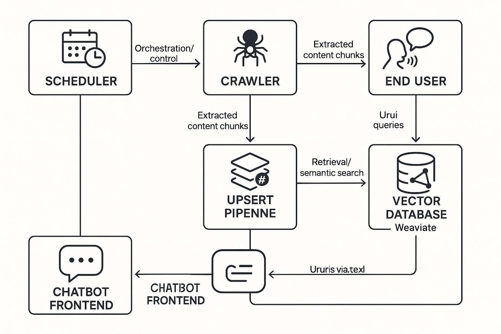
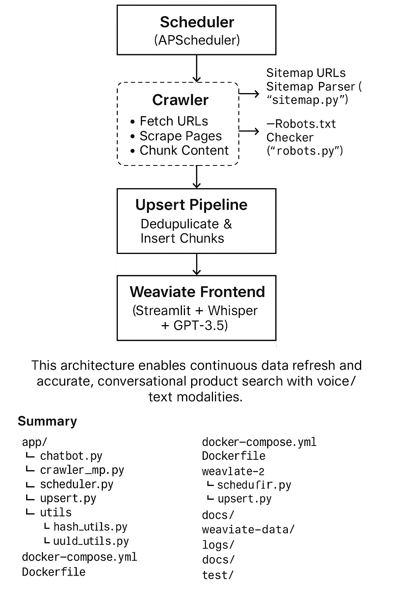

# 005 System Architecture

## Overview

The Periodic Crawler Retrieval-Augmented Generation (RAG) system is composed of several loosely coupled, modular components that work together to provide continuous ecommerce content crawling, semantic indexing, and an interactive chatbot interface.

This architecture enables scalable, maintainable, and extensible operation, facilitating seamless integration of crawling, vector storage, AI-based retrieval, and user interaction.

---

## Main Components

### 1. Scheduler (`app/scheduler/scheduler.py`)

- Orchestrates the entire pipeline by triggering crawling and indexing at periodic intervals (default every 30 minutes).
- Uses APScheduler for job scheduling and logging to `logs/scheduler.log`.
- Invokes the crawler and upsert pipelines sequentially.

### 2. Crawler (`app/crawler/crawler_mp.py` and helpers)

- **Crawler Core**:  
  - Uses Selenium (headless Chrome) to scrape ecommerce product pages dynamically.  
  - Parses sitemap URLs extracted asynchronously (`app/crawler/sitemap.py`).  
  - Respects crawling restrictions via robots.txt (`app/crawler/robots.py`).  
  - Chunks page text content into configurable sizes (~1000 chars).  
  - Computes content hashes (SHA-256) to detect updates and avoid reprocessing identical data.  

- **Concurrency**:  
  - Utilizes Python asyncio with semaphores to crawl multiple URLs concurrently.  

- **Supporting scripts**:  
  - Additional test scripts for crawling strategies and technologies reside in the `app/test/` folder.

### 3. Upsert Pipeline (`app/upsert/upsert.py` and `setup_schema.py`)

- Connects to Weaviate vector DB using `weaviate` SDK on default localhost ports (8080 HTTP, 50051 gRPC).  
- Uses OpenAI embeddings (via `text2vec-openai` module) for vectorization.  
- Manages deduplicated upsert logic: inserts new, replaces updated, skips unchanged chunks based on hash and UUID.  
- Schema setup and data wipe utilities available in `setup_schema.py` and `wipe_weaviate.py`.

### 4. Vector Database — Weaviate (`docker-compose.yml` + `weaviate-data/`)

- Persistent vector DB storing all page chunks with metadata (chunk_id, url, hash, last_updated, content).  
- Configured with OpenAI API key for generating semantic embeddings.  
- Runs as a Docker container with volumes mounted for storage durability.

### 5. Chatbot Frontend (`app/chatbot/chatbot.py`)

- Streamlit-based app providing a voice-enabled interface for product question-answering.  
- Integrates:  
  - Whisper for speech recognition.  
  - pyttsx3 for text-to-speech (TTS).  
  - OpenAI GPT-3.5 Turbo for generative answer synthesis.  
  - Weaviate semantic search (`near_text` query) for context retrieval from indexed chunks.

### 6. Utility Modules (`app/utils/`)

- `hash_utils.py`: Content normalization and SHA-256 hash computation logic.  
- `uuid_utils.py`: UUID generation from chunk IDs for consistent data referencing.

---

## Data & Control Flow Diagram (Textual)

---

## Summary

This architecture enables continuous data refresh and accurate, conversational product search with voice/text modalities.  
The modular code structure (detailed in your repo tree) ensures ease of maintenance and future extensibility for new crawling methods, AI models, or client interfaces.

---

*This file corresponds with the directory structure and files as shown below for reference:*

